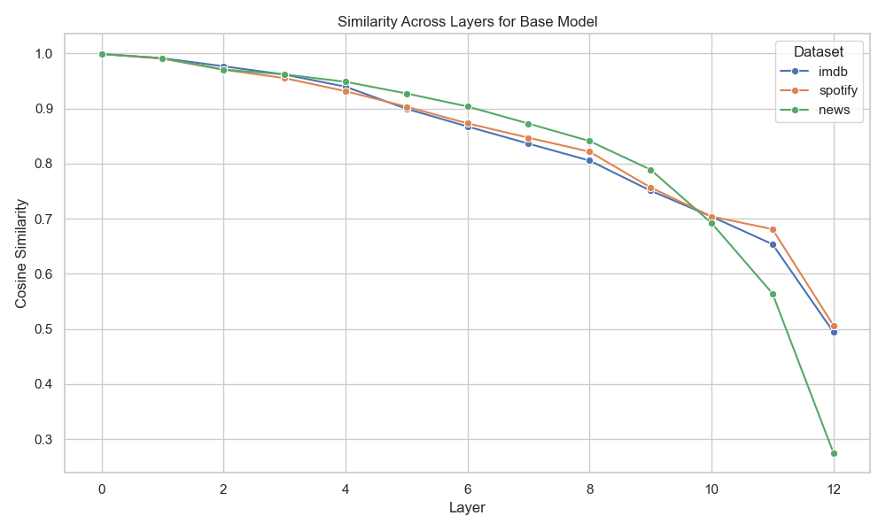

# Transformers-MI: Interpreting Features in Pre-Trained and Fine-Tuned Transformer Models

## Table of Contents

- [Introduction](#introduction)
- [Repository Structure](#repository-structure)
- [Installation](#installation)
- [Experiment Setup](#experiment-setup)
- [Methodology](#methodology)
- [Results](#results)
- [Conclusion](#conclusion)
- [Future Work](#future-work)
- [Contributing](#contributing)
- [License](#license)

## Introduction

This GitHub repository explores the fine-tuning process in transformer models through the application of Sparse AutoEncoders (SAEs). SAEs are used to promote monosemanticity within transformer activations, isolating individual features into interpretable and sparse forms. These extracted features are then analyzed to gain insights and address fundamental questions about the fine-tuning process, such as:

- How does fine-tuning adapt transformer models to specific tasks?
- What roles do different layers play during fine-tuning?
- Which pretrained features are retained, and how are they reused?
- Which base features are overwritten during task-specific adaptation?
- How do transformer models evolve their representations for specialized learning?

## Tok-Viz: Web App

To explore the results of this experiment for yourself without having to set everything up, head on over to [Tok-Viz](https://tok-viz.streamlit.app/)! Tok-Viz is a Streamlit Webapp designed to help users run their own mini-experiments and mess around with some of the features from this experiment.

## Repository Structure

The repo is structured in the following manner:

```
transformers-mi/
├── README.md              
├── LICENSE                
├── requirements.txt       # Dependencies for the project
├── data/                  # Placeholder or instructions for datasets
│   ├── fine_tuning/            # Base datasets for fine-tuning
│   ├── processed/              # Processed data like activations and embeddings
│       ├── activations/
│       ├── embeddings/
├── models/                # Weight files for trained models
│   ├── fine_tuning/            # Fine-tuned .pt models
│   ├── saes/                   # Trained Sparse AutoEncoders
├── notebooks/             # Contains notebooks used for experimentation
│   ├── embeddings.ipynb        # Notebook used to extract and compare embeddings
│   ├── fine_tuning.ipynb       # Notebook used to fine-tune and evaluate BERT on different datasets
│   ├── sae.ipynb               # Notebook used to train saes and analyze top features for interpretation
├── results/               # Contains plots and logs of various graphs, analysis, etc
│   ├── logs/                   
│   ├── plots/
├── scripts/               # Various scripts for differnt parts for the experiments
│   ├── embeddings/             # All code related to extracting and comparing embeddings from a model's layers
│       ├── comparison.py
│       ├── extraction.py
│       ├── run.py
│   ├── fine_tuning/            # All code related to training and infering BERT models
│       ├── infer_model.py
│       ├── run.py
│       ├── train_model.py
│   ├── sae/                    # All code related to training SAEs and analysing features
│       ├── infer_sae.py
│       ├── run.py
│       ├── train_sae.py
├── utils/                # Contains scripts for helper functions
│   ├── config.py              # Script with fixed variables used throughout experiments
│   ├── gpu_test.py            # Script to confirm GPU works
│   ├── utils.py               # Script with helper functions
└── .gitignore             # Files to exclude from Git version control
```

## Installation

1. Clone the repository:
    ```bash
    git clone https://github.com/suneel-nadipalli/transformers-mi.git
    cd transformers-mi
    ```

2. Install dependencies:
    ```bash
    pip install -r requirements.txt
    ```

3. Run any of the notebooks in the `notebooks` folder or the `run.py` scripts in the `scripts` folder

## Experiment Setup

This section outlines the setup for the experiment.

### 1. **Datasets**
- **IMDb**: A dataset for binary sentiment analysis, containing movie reviews labeled as `positive` or `negative`.
- **Spotify**: A dataset for ratings on a scale of 1-5 for the Spotify app.
- **News**: A dataset for news topic classification, categorizing articles into 5 categories.

### 2. **Models**
- **Pretrained Model**: The base `bert-base-uncased` model and certain size-based variations (`bert-medium`, `bert-small`, `bert-tiny`)
- **Fine-Tuned Models**: The `bert-base-uncased` model fine-tuned on the respective datasets.

### 3. **Layers**
- Three representative layers were selected for each dataset:
  - **Early Layer**: Captures low-level syntax and token-level information (e.g., Layer 3).
  - **Middle Layer**: Transitions to semantic and context-based representations (e.g., Layer 6).
  - **Late Layer**: Encodes task-specific adaptations (e.g., Layer 12).

### 4. **Reproducibility**
- Scripts for dataset preparation, activation extraction, and feature analysis are provided in the `scripts` folder.
- Usage examples are provided in both the `notebooks` folder and the `run.py` scripts.
- Note: Change `IF_NB` (found in `utils/config.py`) to False when running the `run.py` scripts and to True when running the notebooks

## Methodology

The step-by-step process for the experiment, detailing each stage.

### 1. Fine-Tuning
The `bert-base-uncased` model was fine-tuned individually on the three datasets:

### 2. Comparing Activations
Activations from eahc layer for every variation of the `bert-base-uncased` model were extracted for both pre-trained and fine-tuned models. Cosine similarity was then used to compare these activations and their evolution across the layers for the datasets and model variations. Based on the results, certain hypotheses were established prior to analysing the SAEs.

### 3. Extracting Activations
Activations for each dataset and model were extracted from 3 pivotal layers (3, 6, 12) and stored for further analysis

### 4. Training Sparse AutoEncoders
Sparse AutoEncoders (SAEs) were trained on the extracted activations from each layer

### 5. Analyzing Top Features
Using the activations from the SAEs, the most active features for each layer and dataset were identified. For both pre-trained and fine-tuned models, and token-level activations were visualized to interpret what these features represent.

## Results

This section presents the results obtained throughout the experiment

### Fine-Tuning Results

The table below summarizes the accuracy of the `bert-base-uncased` model before and after fine-tuning on the three datasets:

| Dataset   | Task   | Pre-Trained Accuracy| Fine-Tuned Accuracy|
|---------|-----------|---------------|---------------------|
| IMDB | Binary Sentiment Classification | 54% | 93% |
| Spotify | Multiclass Sentiment Classification | 12% | 57% |
| News | Topic Classification | 12% | 92% |

While the IMDb and News datasets demonstrated significant improvements post-fine-tuning, the Spotify task achieved comparatively lower accuracy. This dataset was included  to investigate whether task performance has any effect on the fine-tuning process.

### Embedding Comparisons

Comparing the similarity of average activations across datasets between pre-trained and fine-tuned models helped establish a foundational hypothesis about the internal mechanisms of the fine-tuning process.



This graph summarizes the similarity curve for the `bert-base-uncased` model across all three datasets. A common trend is observed where similarity decreases as layers progress, providing insights into the role of different layers during fine-tuning:

- **Early Layers**:
    - The first few layers show high similarity between pre-trained and fine-tuned models.
    - These layers likely retain general-purpose representations responsible for basic semantic capturing, which seems to remain consistent across all 3 tasks.

- **Middle Layers**:
    - There's a more noticable difference in the similarity values across the datasets.
    - This would indicate that these layers start adapting to speicic tasks whiles till retain some foundational learnings from the base model.

- **Later Layers**:
    - The final layers exhibit the largest discrepancy, both within individual datasets and across datasets.
    - This suggests that the last layers are where the model fully adapts to the task, encoding task-specific patterns and features.


Additionally, differences in the similarity curves across datasets provide further insights:

- Sentiment analysis datasets (e.g., IMDb and Spotify) share a closer drop-off in similarity, indicating more alignment between tasks.
- The news dataset, which involves topic classification, shows a more distinct divergence, reflecting the model's adaptation to a different task domain.

These observations suggest a clear progression of feature specialization across transformer layers during fine-tuning. Early layers retain general-purpose features, middle layers shift toward task-specific adaptations, and late layers finalize the task-specific representations, aligning the model with its objective.

### SAE Analysis

The top activating features from the SAEs were further anaylysed to study the evolution of feature representations through the transformer and the fine-tuning process.

This section highlights key observations of this analysis for each layer and dataset, comparing the pre-trained and fine-tuned models to uncover how task-specific adaptations emerge.

| Layer | Dataset | Pre-Trained Model  | Fine-Tuned Model                           
|---------|-----------|--------------------------------------------------|--------------------------------------------------|
| Layer 3 | IMDB      | Activates on general words (e.g., prepositions, articles); very sparse for domain-specific words.      | Activates highly on domain-specific words (e.g., “cast,” “plot,” “director”); emotional polarity (+ve/-ve) influences activation values.| 
|         | Spotify   | Sparse activations; does not show task-specific focus.        | Activates on sentiment and domain words (e.g., “rock,” “happy,” “sad”). |
|         | News      | Activates sparsely unless emotional words are mentioned. | Activates for domain and general semantic words, with sparse activation for sentiment markers.  | 
| Layer 6 | IMDB      | Activates on general and sentiment words (e.g., “love,” “hate”); activates highly on last words. | Encodes both general and domain-specific words; activates consistently on punctuation (e.g., CLS, SEP); higher activation for -ve sentiment words.
|         | Spotify   | Activates broadly for most words without clear patterns.                 |Encodes combined effects of domain words (e.g., music,” app) and sentiment markers.
|         | News      | Represents high-level sentiment context and general semantics.  | Activates on domain words and general semantics; reduced focus on sentiment markers.    | 
| Layer 12| IMDB      | Activates similarly across sentences but shows small variations for +ve/-ve words.         | Strongly differentiates between positive and negative sentiment with high contrast in activation values.    | 
|         | Spotify   | Activates highly on emotional words and the `[SEP]` token |Encodes a range of emotional intensity, clearly distinguishing positive and negative sentiment.    | 
|         | News      | Focuses on general words with minimal task-specific adaptation. | Encodes domain features, specifically the `food` class


## Conclusion

This study aimed to uncover the inner workings of fine-tuning in transformer models by leveraging Sparse AutoEncoders (SAEs) to analyze task-specific feature evolution across layers and datasets. The results provide compelling evidence of how fine-tuning transforms transformer representations and clarify the distinct roles of pre-trained and fine-tuned features across different tasks.

Key conclusions include:

-  **Feature Evolution Across Layers**:
    - Early Layers (eg, Layer 3):
        - Pre-trained models retain general syntactic features and exhibit sparse activation for task-specific patterns.
        - Fine-tuning introduces domain-specific adaptations while preserving general features, particularly in sentiment-heavy datasets like IMDb and Spotify.

    - Middle Layers (eg, Layer 6):
        - These layers act as transitional stages, blending general semantics with emerging task-relevant representations.
        - Fine-tuned models amplify domain-specific patterns while maintaining broader semantic context.

    - Late Layers (eg, Layer 3):
        - The final layers specialize heavily in task-specific decision-making. Fine-tuned models exhibit polarized activations, encoding features uniquely aligned with task objectives.

- **Pre-Trained vs. Fine-Tuned Representations**:
    - Pre-trained models encode general-purpose features, emphasizing semantic and syntactic versatility.
    - Fine-tuning adapts these representations by overwriting irrelevant features and introducing new, task-specific patterns, especially in later layers.

- **Task-Specific Insights**:
    - IMDb: Sentiment markers dominate activations, with clear differentiation between positive and negative sentiment in fine-tuned models.
    - Spotify: Emotional intensity and genre-specific features emerge strongly during fine-tuning.
    - News: Representations shift from general semantics to domain-specific topic markers, such as “politics” or “economy.”

These findings highlight how the representations within a transformer evolve to adapt to handle a wide variety of tasks. Understanding this process further can inform future developments in model interpretability, transfer-learning and task-specific optimization.

## Future Work
The findings from this study open several avenues for further exploration and refinement. To build on the hypotheses and insights established here, the following directions are proposed:

- **Expanding the Scope of Models and Tasks**:

    - Conduct experiments on a broader range of transformer architectures (e.g., RoBERTa, GPT models, T5) to assess the generalizability of the observed trends.

    - Test fine-tuning on a diverse set of tasks, including multi-modal tasks, generative tasks, and low-resource tasks, to validate and refine the hypotheses about feature evolution and task adaptation.

- **Training Larger Sparse AutoEncoders**:

    - Develop and train larger, more expressive Sparse AutoEncoders to enhance monosemanticity and provide clearer separations between features.

    - Investigate the relationship between autoencoder size, sparsity penalties, and interpretability to better define task-relevant features.

- **Analyzing Poor Task Adaptation**:

    - Focus on tasks where fine-tuning results in poor performance, replicating the same experiments to explore differences in feature evolution compared to well-adapted tasks.

    - Investigate why certain tasks fail to align well with the pre-trained transformer representations and whether these limitations are intrinsic to the architecture or dataset-specific.

- **Publication**:

    - I'm currently focusing on expanding this experiment into a structured and formal research paper and subsequently publishing it.


By addressing these directions, the field can move closer to a comprehensive understanding of how transformers work and shedding light on the fine-tuning process works.

## Contributing
I welcome contributions! Please open an issue or submit a pull request.

## License
This project is licensed under the MIT License. See the [LICENSE](LICENSE) file for details.
